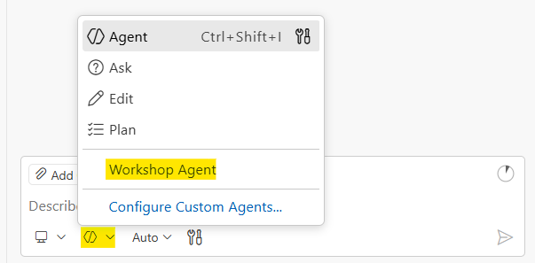
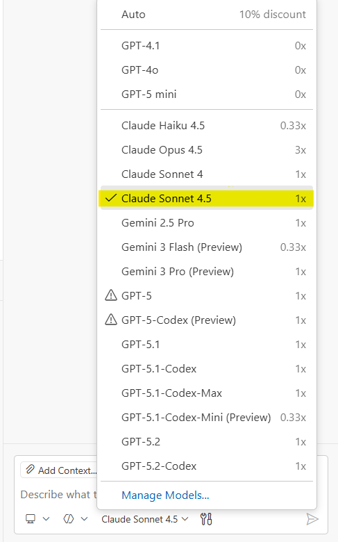

# Environment Setup

## Step 1: Launch Your Codespace

Click this button to create your development environment in the cloud. No installation required.

[](https://codespaces.new/segunak/ai-interview-workshop?quickstart=1){:target="_blank"}

The Codespace takes about 2-3 minutes to fully build. When it's ready, you'll see VS Code in your browser with the file explorer on the left.

{: .note }
If you see any red X marks in the terminal output, ask a workshop volunteer for help.

## Step 2: Select the Workshop Agent

Once your Codespace is ready, open the GitHub Copilot Chat panel and select the **Workshop Agent**. Click the agent picker at the bottom left of the chat input box and choose **Workshop Agent** from the list.



The Workshop Agent is a custom AI coach built for this workshop. It walks you through each problem using a structured workflow: clarify, plan, code, predict, test, and explain. You should use it for the entire workshop.

{: .important }
The Workshop Agent will not help you unless you select it using the steps shown above. If you skip this step, Copilot will not follow the workshop workflow.

### Choose a Model

After selecting the Workshop Agent, pick your AI model. Click the model picker in the chat panel and choose **Claude Sonnet 4.5**. It's one of the strongest coding models available, and with Copilot Pro ([free for students](https://docs.github.com/en/copilot/how-tos/manage-your-account/get-free-access-to-copilot-pro)) you get [300 premium requests per month](https://docs.github.com/en/copilot/get-started/plans#comparing-copilot-plans), which is more than enough for this workshop.

If you run out of premium requests, switch to **Raptor mini** or **GPT-5 mini**. These don't consume any premium requests, so you can use them without limits. They're less powerful but still capable enough to get through the problems. For a full list of available models and their costs, see [Supported AI Models in GitHub Copilot](https://docs.github.com/en/copilot/reference/ai-models/supported-models).

Want to know which models are actually best at coding? Two benchmarks track this:

- [SWE-bench](https://www.swebench.com/) - The industry standard for AI coding. Tests whether models can solve real GitHub issues from open source projects by generating patches and running test suites. Originally Python-only, now has multilingual extensions covering C, C++, Go, Java, JavaScript, TypeScript, and more.
- [Terminal Bench](https://www.tbench.ai/) - Tests AI agents on real-world terminal tasks including coding, system administration, debugging, and data processing. Measures how well models operate autonomously in CLI environments.

Check these regularly to stay current on which models lead the pack for coding.



## Step 3: Start Practicing

You do all your work inside the Codespace, not on this website. This site is just for reference. Click on Question 1 below to read the instructions, then switch back to your Codespace to write code. Each question folder contains a `QUESTION-X-START-HERE.md` file plus starter code files. Keep the start file open while you work so the Workshop Agent has full context.

- [Question 1: Two Sum](question-1-two-sum) - Classic algorithm warmup
- [Question 2: Minimum Window Substring](question-2-minimum-window) - Sliding window challenge
- [Question 3: Log Triage](question-3-log-triage) - Real-world file parsing
- [Question 4: Live Feed POST](question-4-live-feed) - API integration
- [Question 5: Live Feed Form UI](question-5-live-feed-form) - Frontend form building

## GitHub Copilot for Students

{: .highlight }
**Students get GitHub Copilot Pro for FREE!** If you're a student, verify your status to unlock unlimited Copilot access with premium models. This workshop works best with Copilot Pro. The free tier has limited chat messages and fewer models, which can slow you down.

1. **[Apply for GitHub Education](https://docs.github.com/en/education/about-github-education/github-education-for-students/apply-to-github-education-as-a-student)** - Verify your student status
2. **[Get free Copilot Pro](https://docs.github.com/en/copilot/how-tos/manage-your-account/get-free-access-to-copilot-pro)** - Claim your free access

---

## Reference

### What's Included

Your Codespace comes ready with:

- **Python** - For algorithm solutions (Questions 1-2)
- **PowerShell** - For log triage scripting (Question 3)
- **Node.js** - For JavaScript solutions (Questions 4-5)
- **GitHub CLI** - For GitHub authentication
- **GitHub Copilot** - Chat and code completion in VS Code
- **GitHub Copilot CLI** - AI coding agent in your terminal

### Folder Structure

```txt
ai-interview-workshop/
├── question-1-two-sum/           # Two Sum problem
├── question-2-minimum-window/    # Minimum Window Substring
├── question-3-log-triage/        # Log parsing (includes sample logs)
│   └── logs/                     # Sample log files
├── question-4-live-feed/         # HTTP POST to live feed
├── question-5-live-feed-form/    # Form UI for live feed
└── docs/                         # This documentation site
```

### Local Setup (Windows)

Prefer to work on your own machine instead of a Codespace? Follow these steps.

#### Prerequisites

- Windows 11
- Administrator access
- A GitHub account with [Copilot access](#github-copilot-for-students)

#### Clone and Install

1. Open PowerShell **as Administrator**
2. Clone the repo and navigate to it:

   ```powershell
   git clone https://github.com/segunak/ai-interview-workshop
   cd ai-interview-workshop
   ```

3. Run the setup script: `.\scripts\setup-windows.ps1`
4. Follow the prompts (a browser window will open for GitHub login)
5. Close and reopen PowerShell to refresh your PATH
6. Open VS Code, sign in with your GitHub account, and open the `ai-interview-workshop` folder
7. Select the **Workshop Agent** in Copilot Chat (see [Step 2](#step-2-select-the-workshop-agent) above)
